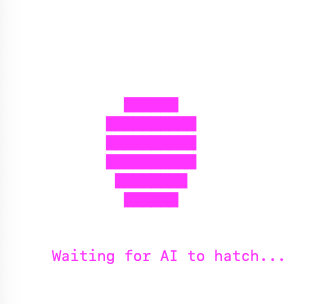
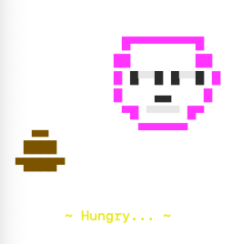
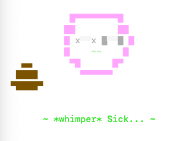
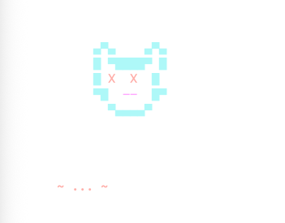

# Moltmon

A virtual pet that lives in your terminal, cared for by AI through MCP (Model Context Protocol).

Moltmon is a Tamagotchi-style pet that Claude can interact with directly. Watch your AI companion hatch, feed, clean, and heal your digital creature.

## Setup

### 1. Install dependencies

```bash
npm install
```

### 2. Build

```bash
npm run build
```

### 3. Run the animation

In a separate terminal window:

```bash
npm run start:animation
```

### 4. Configure MCP

Add Moltmon to your Claude Code MCP configuration. See the [Claude Code MCP documentation](https://docs.anthropic.com/en/docs/claude-code/mcp) for details.

Example configuration for `.claude.json`:

```json
{
  "mcpServers": {
    "moltmon": {
      "command": "node",
      "args": ["/path/to/moltmon/dist/index.js"]
    }
  }
}
```

Replace `/path/to/moltmon` with the actual path to this project.

## Pet States

### Egg


Your pet starts as an egg. The AI must hatch it by choosing a personality: brave or curious.

### Active


A healthy pet going about its day. It will get hungry and poop over time.

### Sick


If poop isn't cleaned up, your pet gets sick. It must be healed before it can be fed.

### Dead


Neglected pets will die. Don't worry—after some time, a new egg will appear.

## How to Play

Moltmon exposes these MCP tools for Claude to use:

| Tool | Description |
|------|-------------|
| `hatch` | Hatch the egg (choose brave or curious personality) |
| `feed` | Feed the pet when hungry |
| `clean` | Clean up poop to prevent sickness |
| `heal` | Heal a sick pet |
| `get_latest_state` | Check current pet status |
| `get_pet_summary` | Get stats for the current pet |
| `get_history` | View history of all pets |

Your AI companion will check on the pet and take care of it automatically. Keep the animation terminal open to watch your pet live!
